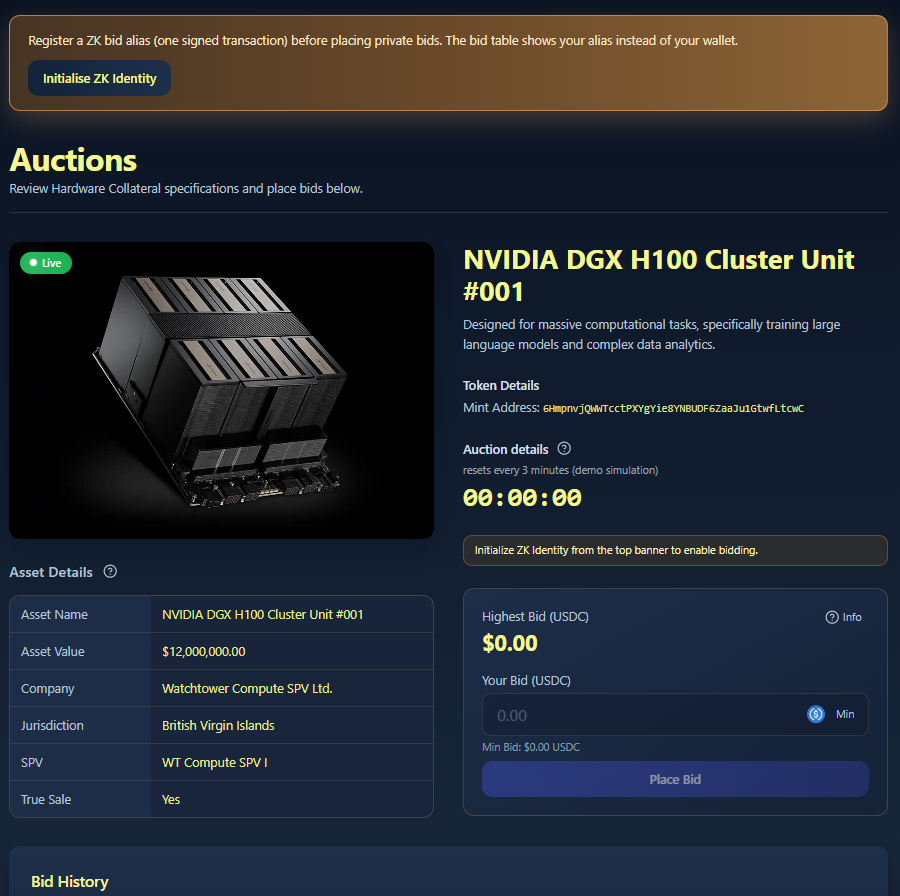
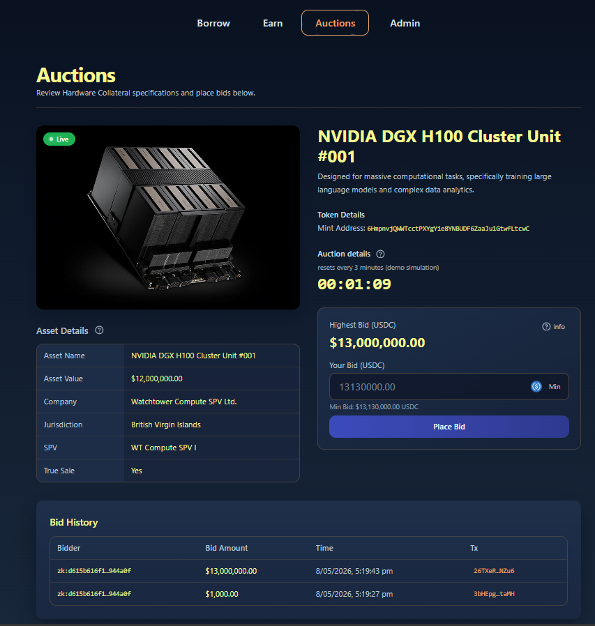
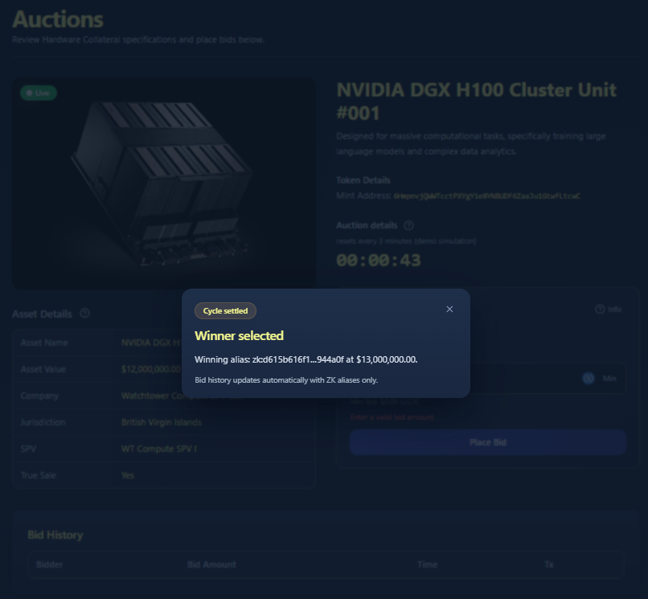

# Auctions & Underwriting

### Zero-Knowledge (ZK) Identity

Due to the nature of hardware, privacy is an important feature of auctions. Every registered and approved bidder requires to create a zero-knowledge (zk) ID prior to participating in auctions.

<figure><figcaption></figcaption></figure>

### Liquidation Auctions

<figure><figcaption></figcaption></figure>

<figure><figcaption></figcaption></figure>
