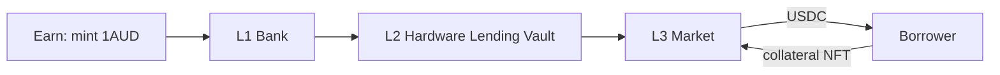

# Lending v2

### What this page covers

How **lending** works in IAUD v2: who supplies USDC, how hardware borrowers draw and repay, how risk is isolated per market, and how this differs from v1’s single `nft_lending_pool`.

See also `docs/IAUD_Version_2.md` and v1 pages `Lending.md` / `Tokenise-and-Borrow.md`.

***

### High-level picture

In v2, **the Hardware Lending Vault (L2) does not “make loans” directly**. It holds USDC and an **adapter** that **supplies** USDC into **Layer 3 markets**. Each market is an isolated pool:

`(USDC, collateral_NFT_mint, oracle, interest_model, LLTV)`.

Borrowers post **tokenised hardware NFTs** as collateral and borrow **USDC** from that market. Lenders in the economic sense are **1AUD holders** and vault LPs; on-chain **suppliers** at L3 are usually the vault adapter’s market position only.

**Permissionless market creation** is allowed; **liquidity** only flows where the **Curator** sets **caps** and the **Allocator** calls `allocate`.

***

### Layer responsibilities

| Layer                     | Lending function                                                                                        |
| ------------------------- | ------------------------------------------------------------------------------------------------------- |
| **L3 `hardware_markets`** | Positions, interest accrual, health factor, liquidation, bad-debt socialization among market suppliers. |
| **L2 vault + adapter**    | Caps, rebalancing, `real_assets()` for bank NAV; optional v1 wrap via `HardwareLendingV1Adapter`.       |
| **L1 bank**               | Does not touch borrower collateral; reflects vault outcomes in 1AUD price.                              |

**Collateral custody:** v1 `collateral_vault` (lock / unlock / seize) remains for legacy flows; v2-native markets use market authority PDAs per design. NFTs are typically **supply = 1** per tokenised unit.

***

### Markets: how many, how defined

* **No fixed max** market count in the design—each distinct `MarketParams` gets a `MarketState` PDA (`id = hash(params)`).
* Parameters are **immutable** after creation; changing LLTV or oracle means **a new market** and migrating liquidity by choice.
* **LLTV** for hardware uses a **conservative ladder** (e.g. 38.5% / 50% / 62.5% tiers)—not the highest Morpho brackets.

**Suppliers** at L3 = addresses with **supply shares** in the loan asset (USDC). In the default design, that is the **Hardware Lending Vault adapter**, not retail wallets lending directly—unless you later allow direct `supply` alongside the vault.

**Borrowers** = wallets with collateral posted and **borrow shares** outstanding on a `Position` PDA per `(market, borrower)`.

***

### Origination flow (v2)

Compared to v1 `create_loan_manual` (admin-signed, `manual_collateral_value`):

1. **Tokenise** hardware → NFT mint (existing `record_tokenised_hardware` path).
2. **Oracle** publishes collateral price (Watchtower attestation or approved feed).
3. **`create_market`** if no market exists for this collateral class / mint policy.
4. Borrower **`supply_collateral`** then **`borrow`**; post-trade **LTV ≤ LLTV** or revert.
5. Curator must have set **caps** so the vault was allowed to **`allocate`** USDC into that market.

Underwriting moves from per-loan admin fields to **market design + oracle + caps + LLTV** at origination time.

***

### Interest and repayment

* Interest accrues **lazily** when the market is touched (`supply`, `withdraw`, `borrow`, `repay`, `liquidate`, `accrue_interest`).
* IRM returns a per-second borrow rate; debt and supplier assets grow with accrued interest.
* **Repay:** partial or full (`repay` with borrow shares for dust-free close); then **`withdraw_collateral`** when debt is zero.

Vault **`harvest()`** may roll market interest into reported `real_assets()` for bank NAV updates on a schedule.

***

### Risk controls (implementation)

| Control                       | Owner                         | Effect                                                                      |
| ----------------------------- | ----------------------------- | --------------------------------------------------------------------------- |
| **Absolute / relative caps**  | Curator (increase timelocked) | Limits USDC per market, collateral class, jurisdiction, oracle vendor, etc. |
| **`allocate` / `deallocate`** | Allocator                     | Moves USDC between markets within caps.                                     |
| **Sentinel**                  | Bank-appointed                | Instant cap decreases, deallocate, revoke pending curator txs.              |
| **Circuit breakers**          | Bank / vault / adapter        | Pause new risk without necessarily blocking exits.                          |
| **Pre-liquidation**           | Borrower opt-in               | Soft deleveraging before hard LLTV breach.                                  |

**Bad debt:** If liquidation leaves debt with zero collateral, market writes down `total_supply_assets` **pro-rata** across suppliers → vault `real_assets()` falls → 1AUD price may fall unless first-loss vault absorbs (see First Loss page).

***

### Lender journey (Earn)

1. User **mints 1AUD** (typically via USDC → Reserve vault)—not “deposit to pool” on `nft_lending_pool`.
2. Economic exposure to hardware lending is the **share of bank NAV** in the Hardware Lending Vault (and any other vaults), not a separate IAUD pool share formula.
3. **Redeem** burns 1AUD and pulls USDC (or other vault asset) subject to vault liquidity and `deallocate`.

**Force deallocate:** Permissionless pull from adapter to vault idle with penalty—exit valve if curator misallocates or markets are illiquid.

***

### Migration from v1 lending

* Phase 0: **`HardwareLendingV1Adapter`** CPIs v1 pool deposit/withdraw; `real_assets()` reads v1 `total_assets`.
* Later: native L3 markets + caps; wind down v1 adapter allocation.

v1 programs (`nft_lending_pool`, `collateral_vault`) stay deployed during transition.

***

### Related pages

* **IAUD v2 Architecture** — stablecoin yield and L1/L2/L3 roles.
* **Auctions v2** — when liquidation uses english auction instead of instant seize.
* **First Loss v2** — optional junior buffer above pro-rata market losses.
