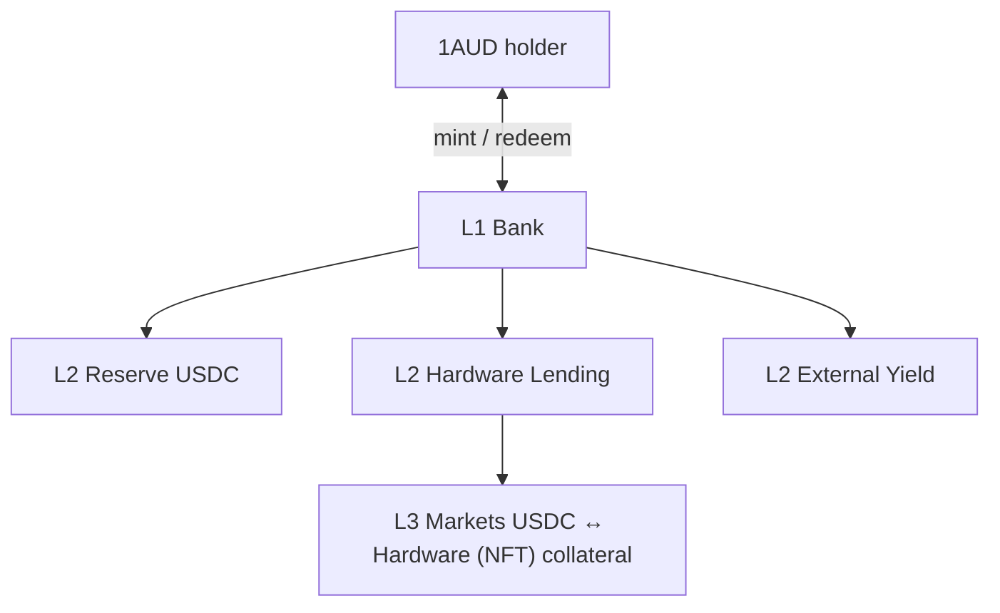

# IAUD v2 Architecture

This page explains how **1AU Dollar** (IAUD) works as a yield-bearing stablecoin in the modular stack (**Bank → Vaults → Markets)** and how yield reaches holders, and what each layer is responsible for.

***

### High-level Architecture

IAUD v2 is not a single lending pool like in v1. Holders hold **$IAUD**, a non-rebasing SPL token whose **unit price appreciates** as backing NAV grows —balances stay fixed; dollars-per-IAUD drift up.

A clean three layers stack:

<table><thead><tr><th width="91">Layer</th><th width="208">Name</th><th>Stablecoin role</th></tr></thead><tbody><tr><td><strong>L1</strong></td><td>Issuance Bank</td><td>Only place $IAUD is minted or burned. Enforces <strong>$IAUD supply ≤ sum of vault NAV</strong>. Sets <code>iaud_price</code> from aggregate backing.</td></tr><tr><td><strong>L2</strong></td><td>Strategy vaults</td><td>Where assets sit and <strong>yield is earned</strong>. Each vault has one underlying asset and an <strong>adapter</strong> that reports <code>real_assets()</code> in USD.</td></tr><tr><td><strong>L3</strong></td><td>Lending markets</td><td>Where the <strong>Hardware Lending Vault</strong> deploys USDC into isolated borrower markets. Yield here is <strong>borrower interest</strong>; risk is <strong>per market</strong>.</td></tr></tbody></table>

**Slot 0** is always the **USDC Reserve Vault**—liquid redemption anchor. Other slots are curator-managed (hardware lending, external yield, and room for future products such as first-loss capital).

***

### How yield reaches $IAUD

Yield does **not** rebase token balances. It increases **vault TVL**, which increases **bank NAV**, which increases **$IAUD price**.

<table><thead><tr><th width="207">Yield source</th><th width="111">Layer</th><th>Mechanism</th></tr></thead><tbody><tr><td>Borrower interest</td><td>L3 → L2</td><td>Markets accrue interest on USDC supplied by the vault adapter; <code>real_assets()</code> on the Hardware Lending Vault rises.</td></tr><tr><td>External strategies</td><td>L2</td><td><strong>External Yield</strong> vaults: two-phase reporting (<code>report_yield</code> → <code>push_yield</code>) moves tokens in and updates TVL.</td></tr><tr><td>Internal / oracle-marked assets</td><td>L2</td><td><strong>Internal Yield</strong> vaults: NAV from oracle-priced positions (e.g. LST-style assets).</td></tr><tr><td>Reserve / discretionary</td><td>L2 slot 0</td><td>USDC reserve is yield-zero by default; team may inject rewards that lift NAV.</td></tr></tbody></table>

**Aggregation at L1:** After each material change, the bank sums `vault_tvls_usd` across the registry and updates:

`iaud_price ∝ Σ vault NAV / total_iaud_minted`

Every mint and redeem runs a **seven-step check** (permission, pause, collateralization, execute, consistency, rounding, commit) so the invariant holds before and after the transaction.

***

### Roles by layer (stablecoin lens)

| Role                      | Layer        | What they do for 1AUD                                                                                                                                        |
| ------------------------- | ------------ | ------------------------------------------------------------------------------------------------------------------------------------------------------------ |
| **Holder**                | L1           | Mints 1AUD with supported assets; redeems against a chosen vault when liquidity allows.                                                                      |
| **Bank Manager**          | L1           | Appoints Curator / Sentinel; bank-wide circuit breaker.                                                                                                      |
| **Curator**               | L1–L2        | Adds vaults and adapters; sets caps and fees (timelocked increases).                                                                                         |
| **Allocator**             | L2           | Moves capital between adapters within caps; sets where new deposits auto-route (`liquidity_adapter`).                                                        |
| **Sentinel**              | L1–L2        | Emergency: deallocate, cut caps, revoke pending curator actions—cannot add new risk.                                                                         |
| **Oracle signers**        | L2 / markets | Prices for NAV and collateral; consensus rules on sensitive vaults.                                                                                          |
| **Borrower / liquidator** | L3           | Borrowers do not mint 1AUD; they draw **USDC from markets** backed by vault suppliers. Liquidators protect L3 solvency, which protects L2 NAV and thus 1AUD. |

L3 participants affect the stablecoin **indirectly** by changing market health and vault `real_assets()`, including bad-debt socialization at the market (see Lending and First Loss pages).

***

### Mint and redeem (implementation sketch)

**Mint** (`mint_iaud_with_asset`):

1. User sends a yielding asset into a chosen vault (often USDC → Reserve vault).
2. Bank reads oracle-backed USD value and current `iaud_price`.
3. Bank mints `amount_usd / iaud_price` of 1AUD to the user (minus vault `default_fee_bps` if configured).
4. Vault registry and bank TVL arrays update; invariant rechecked.

**Redeem** (`redeem_iaud`):

1. User burns 1AUD; bank computes `assets_out = iaud_amount × iaud_price`.
2. Vault pays from **idle** balance first; shortfall triggers adapter **`deallocate`**.
3. If still illiquid, user may use **`force_deallocate`** (penalty up to \~2% of shares) per Morpho-style exit guarantees.

1AUD mint authority sits on the **BankState PDA**, not on individual vaults.

***

### Losses and the stablecoin price

Shortfalls flow **up** the stack:

1. **L3:** Bad debt reduces `total_supply_assets` for that market (pro-rata among USDC **suppliers** to that market—typically the Hardware Lending Vault adapter only).
2. **L2:** Adapter `real_assets()` drops → that vault’s slice of bank NAV drops.
3. **L1:** Unless a **first-loss vault** is added later, **all vaults and all 1AUD** share the impairment via lower `iaud_price`. Optional junior tranche is documented on the First Loss page.

***

### v1 vs v2 (stablecoin)

| Topic       | v1                                   | v2                                            |
| ----------- | ------------------------------------ | --------------------------------------------- |
| Token       | 1AUD / `oneaud_mint` in single pool  | 1AUD from **Bank**; NAV from **Σ vaults**     |
| Yield       | Mostly hardware loan APR in one pool | Diversified vault types + isolated markets    |
| Price model | Share minting vs `total_assets`      | **Price appreciation** vs aggregate vault NAV |
| Pause       | One `paused` flag                    | Bank + per-vault breakers                     |

***

### Related pages

* **Lending v2** — USDC deployment, borrowers, markets.
* **First Loss v2** — optional junior capital (not in initial ship scope).
* **Auctions v2** — NFT liquidation backstop when instant seize is insufficient.
