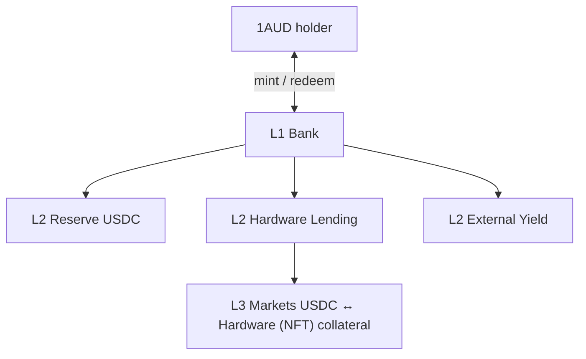

# IAUD v2

This page explains how **1AU Dollar** (IAUD) works as a yield-bearing stablecoin in the modular stack (**Bank → Vaults → Markets)** and how yield reaches holders, and what each layer is responsible for.

***

### High-level Architecture

IAUD v2 is not a single lending pool like in v1. Holders hold **$IAUD**, a non-rebasing SPL token whose **unit price appreciates** as backing NAV grows —balances stay fixed; dollars-per-IAUD drift up.

A clean three layers stack:

<table><thead><tr><th width="91">Layer</th><th width="208">Name</th><th>Stablecoin role</th></tr></thead><tbody><tr><td><strong>L1</strong></td><td>Issuance Bank</td><td>Only place $IAUD is minted or burned. Enforces <strong>$IAUD supply ≤ sum of vault NAV</strong>. Sets <code>iaud_price</code> from aggregate backing.</td></tr><tr><td><strong>L2</strong></td><td>Strategy vaults</td><td>Where assets sit and <strong>yield is earned</strong>. Each vault has one underlying asset and an <strong>adapter</strong> that reports <code>real_assets()</code> in USD.</td></tr><tr><td><strong>L3</strong></td><td>Lending markets</td><td>Where the <strong>Hardware Lending Vault</strong> deploys USDC into isolated borrower markets. Yield here is <strong>borrower interest</strong>; risk is <strong>per market</strong>.</td></tr></tbody></table>

**Slot 0** is always the **USDC Reserve Vault**—liquid redemption anchor. Other slots are curator-managed (hardware lending, external yield, and room for future products such as first-loss capital).

***

### How yield reaches $IAUD

Yield does **not** rebase token balances. It increases **vault TVL**, which increases **bank NAV**, which increases **$IAUD price**.

<table><thead><tr><th width="207">Yield source</th><th width="111">Layer</th><th>Mechanism</th></tr></thead><tbody><tr><td>Borrower interest</td><td>L3 → L2</td><td>Markets accrue interest on USDC supplied by the vault adapter; <code>real_assets()</code> on the Hardware Lending Vault rises.</td></tr><tr><td>External strategies</td><td>L2</td><td><strong>External Yield</strong> vaults: two-phase reporting (<code>report_yield</code> → <code>push_yield</code>) moves tokens in and updates TVL.</td></tr><tr><td>Internal / oracle-marked assets</td><td>L2</td><td><strong>Internal Yield</strong> vaults: NAV from oracle-priced positions (e.g. LST-style assets).</td></tr><tr><td>Reserve / discretionary</td><td>L2 slot 0</td><td>USDC reserve is yield-zero by default; team may inject rewards that lift NAV.</td></tr></tbody></table>

**Aggregation at L1:** After each material change, the bank sums `vault_tvls_usd` across the registry and updates:

`iaud_price ∝ Σ vault NAV / total_iaud_minted`

Every mint and redeem runs a **seven-step check** (permission, pause, collateralization, execute, consistency, rounding, commit) so the invariant holds before and after the transaction.

***

### Roles by layer (stablecoin lens)

<table><thead><tr><th width="151">Role</th><th width="119">Layer</th><th>What they do for 1AUD</th></tr></thead><tbody><tr><td><strong>Holder</strong></td><td>L1</td><td>Mints $IAUD with supported assets; redeems against a chosen vault when liquidity allows.</td></tr><tr><td><strong>Bank Manager</strong></td><td>L1</td><td>Appoints Curator / Sentinel; bank-wide circuit breaker.</td></tr><tr><td><strong>Curator</strong></td><td>L1–L2</td><td>Adds vaults and adapters; sets caps and fees (time-locked increases).</td></tr><tr><td><strong>Allocator</strong></td><td>L2</td><td>Moves capital between adapters within caps; sets where new deposits auto-route (<code>liquidity_adapter</code>).</td></tr><tr><td><strong>Sentinel</strong></td><td>L1–L2</td><td>Emergency: deallocate, cut caps, revoke pending curator actions—cannot add new risk.</td></tr><tr><td><strong>Oracle signers</strong></td><td>L2 / markets</td><td>Prices for NAV and collateral; consensus rules on sensitive vaults.</td></tr><tr><td><strong>Borrower / liquidator</strong></td><td>L3</td><td>Borrowers do not mint $IAUD; they draw <strong>USDC from markets</strong> backed by vault suppliers. Liquidators protect L3 solvency, which protects L2 NAV and thus $IAUD.</td></tr></tbody></table>

L3 participants affect the stablecoin **indirectly** by changing market health and vault `real_assets()`, including bad-debt socialization at the market (see Lending and First Loss pages).

***

### Mint and redeem

**Mint** (`mint_iaud_with_asset`):

1. User sends a yielding asset into a chosen vault (often USDC → Reserve vault).
2. Bank reads oracle-backed USD value and current `iaud_price`.
3. Bank mints `amount_usd / iaud_price` of 1AUD to the user (minus vault `default_fee_bps` if configured).
4. Vault registry and bank TVL arrays update; invariant rechecked.

**Redeem** (`redeem_iaud`):

1. User burns $IAUD; bank computes `assets_out = iaud_amount × iaud_price`.
2. Vault pays from **idle** balance first; shortfall triggers adapter **`deallocate`**.
3. If still illiquid, user may use **`force_deallocate`** (penalty up to \~2% of shares) per Morpho-style exit guarantees.

$IAUD mint authority sits on the **BankState PDA**, not on individual vaults.

***

### Losses and the stablecoin price

Shortfalls flow **up** the stack:

1. **L3:** Bad debt reduces `total_supply_assets` for that market (pro-rata among USDC **suppliers** to that market—typically the Hardware Lending Vault adapter only).
2. **L2:** Adapter `real_assets()` drops → that vault’s slice of bank NAV drops.
3. **L1:** F**irst-loss vault** is added later such that **all vaults and all $IAUD** _do not_ share the impairment via lower `iaud_price`. Junior tranche is documented on the First Loss page.

***

### v1 vs v2 (stablecoin)

<table><thead><tr><th width="128">Topic</th><th>v1</th><th>v2</th></tr></thead><tbody><tr><td>Token</td><td>$IAUD / <code>oneaud_mint</code> in single pool</td><td>$IAUD from <strong>Bank</strong>; NAV from <strong>Σ vaults</strong></td></tr><tr><td>Yield</td><td>Mostly hardware loan APR in one pool</td><td>Diversified vault types + isolated markets</td></tr><tr><td>Price model</td><td>Share minting vs <code>total_assets</code></td><td><strong>Price appreciation</strong> vs aggregate vault NAV</td></tr><tr><td>Pause</td><td>One <code>paused</code> flag</td><td>Bank + per-vault breakers</td></tr></tbody></table>

***

### Related pages

* **Lending v2** — USDC deployment, borrowers, markets.
* **First Loss v2** — junior capital.
* **Auctions v2** — NFT liquidation backstop when instant seize is insufficient.
